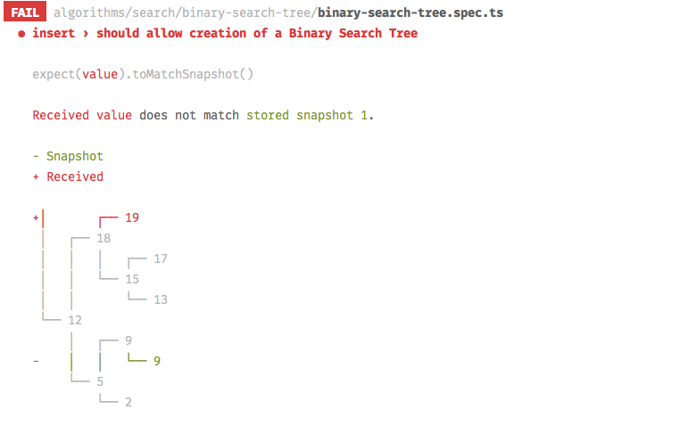

# Pretty algorithms

Common useful algorithms written in modern, pretty and easy-to-understand Javascript. All the algorithms are also tested using [Jest](http://facebook.github.io/jest/) with the help of custom nice-to-read diffs for data structures.



## Note

The purpose of this repository is to show algorithms written using declarative and intuitive code as much as possible. It's not meant to be used as production.

If you need something absolutely performant in production try checking [felipernb/algorithms.js](https://github.com/felipernb/algorithms.js) with low-level optimisations.

Check also [this article about pros and cons of common sorting algorithms](http://www.brucemerry.org.za/manual/algorithms/sorting.html).

## Content

### Miscellanous 

- [Inversion count](algorithms/misc/inversion-count/inversion-count.ts)
- [Maximum subarray](algorithms/misc/maximum-subarray/maximum-subarray.ts)
- [Priority queue](algorithms/misc/priority-queue/priority-queue.ts)

### Search

- [Binary search](algorithms/search/binary-search/binary-search.ts)
- [Binary search tree](algorithms/search/binary-search-tree/binary-search-tree.ts)

### Sort

- [Counting sort](algorithms/sort/counting-sort/counting-sort.ts)
- [Heap sort](algorithms/sort/heap-sort/heap-sort.ts)
- [Insertion sort](algorithms/sort/insertion-sort/insertion-sort.ts)
- [Merge sort](algorithms/sort/merge-sort/merge-sort.ts)
- [Merge and insertion sort](algorithms/sort/merge-and-insertion-sort/merge-and-insertion-sort.ts)
- [Quick sort](algorithms/sort/quick-sort/quick-sort.ts)
- [Selection sort](algorithms/sort/selection-sort/selection-sort.ts)

## Usage

You can play around with the code cloning the repo and running the following commands:

```bash
npm install # or yarn install
npm test # or yarn test
```

Play around with the source code, the tests and learn the algorithms! You can also run the following command to put tests in watch mode and auto-run with changes. [Jest](http://facebook.github.io/jest/) CLI output is awesome!

```bash
npm run test -- --watch
```


## TODO

- Add O(n) implementation of `maximum-subarray`
- Add implementation of `Red-Black Tree`
- Add a real-world usage example of every algorithm
