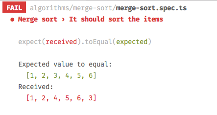

# Pretty sort

Common useful algorithms written pretty and easy to understand with modern Javascript. All the algorithms are also tested using [Jest](http://facebook.github.io/jest/).



## Note

The purpose of this repository is to show algorithms written using declarative and intuitive code as much as possible. It's not meant to be used as production.

If you need something absolutely performant in production try checking [felipernb/algorithms.js](https://github.com/felipernb/algorithms.js) with low-level optimisations.

Check also [this article about pros and cons of common sorting algorithms](http://www.brucemerry.org.za/manual/algorithms/sorting.html).

## Content

- [Counting sort](algorithms/counting-sort/counting-sort.ts)
- [Heap sort](algorithms/heap-sort/heap-sort.ts)
- [Insertion sort](algorithms/insertion-sort/insertion-sort.ts)
- [Merge sort](algorithms/merge-sort/merge-sort.ts)
- [Quick sort](algorithms/quick-sort/quick-sort.ts)

## Usage

You can play around with the code cloning the repo and running the following commands:

```bash
npm install # or yarn install
npm test # or yarn test
```

Play around with the source code, the tests and learn the algorithms! You can also run the following command to put tests in watch mode and auto-run with changes. [Jest](http://facebook.github.io/jest/) CLI output is awesome!

```bash
npm run test -- --watch
```

### TODO

- Add O(n) implementation of `maximum-subarray`
- Add a real-world usage example of every algorithm
